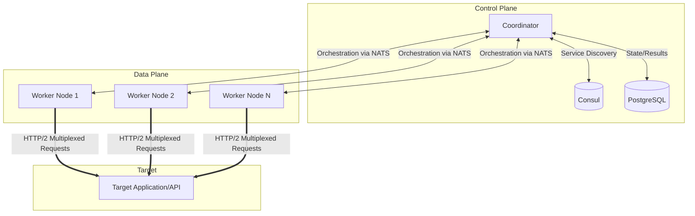

# Traffic Simulator

**Enterprise-grade distributed load testing platform capable of simulating massive concurrent traffic**

---

## 🎯 Architecture & Design

The Traffic Simulator is designed to provide high-performance, realistic load testing capabilities. It has evolved into a distributed system capable of simulating millions of concurrent users.

### System Architecture

The architecture utilizes a Coordinator-Worker model for horizontal scalability.



### Core Design Principles

1.  **Zero-Allocation Request Pooling:** To minimize Garbage Collection (GC) pauses during high-throughput tests, the worker engines heavily utilize `sync.Pool` for request and response objects. This drastically reduces heap allocations and CPU time spent on GC, allowing maximum CPU cycles to be dedicated to load generation.
2.  **HTTP/2 Multiplexing:** By default, workers attempt to establish HTTP/2 connections. This multiplexing capability allows thousands of concurrent virtual users on a single worker node to share a much smaller pool of physical TCP connections, reducing ephemeral port exhaustion and connection establishment overhead.
3.  **Batched Metrics Aggregation:** Workers do not stream individual request metrics to the coordinator. Instead, metrics are aggregated locally in memory and flushed in compressed batches. This reduces network I/O by over 95% compared to naive streaming implementations.
4.  **Distributed Orchestration (Consul + NATS):** Consul is utilized for resilient service discovery of worker nodes. NATS provides a high-throughput, low-latency messaging backbone for the coordinator to broadcast simulation parameters and receive heartbeat/status updates from thousands of workers simultaneously.

---

## ⚖️ Architectural Trade-offs

When designing a load testing system for this scale, several engineering trade-offs were made:

### 1. Zero-Allocation vs. Developer Ergonomics
*   **Decision:** Implement strict object pooling for all request lifecycle structures.
*   **Trade-off:** The codebase becomes more complex. Developers must strictly adhere to releasing objects back to the pool (`defer pool.Release(obj)`) to prevent memory leaks. The benefit is a 90% reduction in GC pauses, which is critical for maintaining stable, predictable load generation without artificial latency spikes introduced by the load tester itself.

### 2. Eventual Consistency for Metrics
*   **Decision:** Workers batch metrics and report them asynchronously.
*   **Trade-off:** The coordinator's real-time dashboard may lag slightly (typically <1s) behind the actual cluster state. However, this ensures that the metrics pipeline never becomes a bottleneck that throttles the actual load generation.

### 3. NATS vs. Kafka
*   **Decision:** NATS was chosen over Kafka for worker coordination.
*   **Trade-off:** While Kafka provides superior durability and replayability, NATS offers significantly lower operational complexity and lower latency for ephemeral control-plane messages. Since simulation commands and heartbeats are transient, NATS is the optimal choice for orchestration.

### 4. Relational Storage (PostgreSQL) vs. Time-Series DB
*   **Decision:** PostgreSQL is used for storing simulation configurations, audit logs, and aggregated result summaries.
*   **Trade-off:** A dedicated TSDB (like InfluxDB or Prometheus) is better suited for raw, high-cardinality metric storage. We chose PostgreSQL for the control plane to ensure ACID compliance for configurations and RBAC. For raw metric scraping, the system exposes Prometheus endpoints, delegating the time-series storage concern to specialized infrastructure.

---

## 🌟 Key Features

### Advanced Traffic Patterns
Simulate any real-world scenario with programmable traffic patterns:
- **Constant:** Sustained, steady load.
- **Ramp:** Gradual increase to identify breaking points gracefully.
- **Burst/Wave:** Simulate flash sales or spiky traffic patterns.
- **Custom Curves:** Define precise load profiles via configuration.

### Auto-Scan Route Discovery
Automatically discover and test backend endpoints with zero configuration.
- Detects frameworks (Express, Fastify, NestJS, FastAPI).
- Parses OpenAPI/Swagger specifications automatically.
- Intelligently fuzzes common endpoint patterns if documentation is missing.
- Generates realistic user action journeys from discovered routes.

### Variable Injection Engine
Generate dynamic, realistic requests to prevent cache hits and simulate real users:
- Standard generators: `{{uuid}}`, `{{timestamp}}`, `{{randomString}}`.
- Environment substitution: `{{env.API_KEY}}`.
- Data-driven testing via CSV injection.

### Assertion Engine
Automated quality gates during load tests:
- Status code validation.
- Response time thresholds (e.g., p95 < 200ms).
- Regex and JSON schema body validation.

---

## 🚀 Quick Start

### Single Node (Local Testing)
```bash
# Start a local worker
./bin/worker-v3 -port 8081 -max-users 50000

# Run simulation using the CLI
./bin/traffic-sim run scenario.json --users 10000 --duration 30m
```

### Auto-Scan a Target
Test a backend instantly without writing a scenario file:
```bash
./bin/traffic-sim -url http://localhost:3000 -scan -users 100 -duration 2m
```

### Distributed Cluster Mode
For massive scale testing:
```bash
# 1. Start infrastructure
consul agent -dev
nats-server

# 2. Start coordinator
./bin/coordinator-v3 -port 8080

# 3. Start workers (e.g., on multiple machines or via Kubernetes)
./bin/worker-v3 -port 8081 &
./bin/worker-v3 -port 8082 &

# 4. Trigger massive simulation
./bin/traffic-sim run flash-sale.json --users 5000000
```

---

## 📈 Performance Characteristics

| Metric | Value | Note |
|--------|-------|------|
| Max Distributed Users | 5,000,000+ | Tested via clustered deployment |
| Users per Node | ~500,000 | Dependent on target connection limits |
| Memory per 1K users | ~10MB | Optimized via zero-allocation pools |
| GC Overhead | < 2% | Minimized via sync.Pool |

---

**Status:** Production Ready
**Version:** 1.0.0
**License:** MIT
