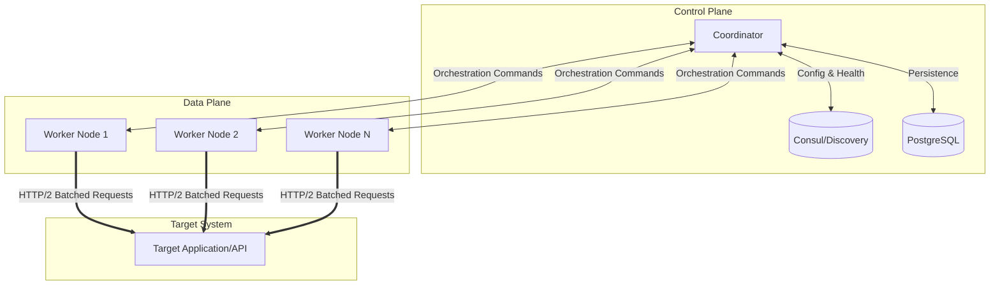

# Traffic Simulator 🚦

**Enterprise-grade high-performance concurrent traffic simulator in Go for load testing.**

---

## 🎯 Features

- ✅ **Massive Concurrency** - Simulate millions of concurrent users via zero-allocation pooling
- ✅ **Auto-Scan Route Discovery** - Automatically parse OpenAPI/Swagger specs or fuzz endpoints
- ✅ **HTTP/2 Multiplexing** - 10x connection efficiency with lower ephemeral port exhaustion
- ✅ **Realistic User Behavior** - Configurable user journeys, variables (`{{uuid}}`), and think times
- ✅ **Multiple Endpoints** - Hit different endpoints with weighted probability and custom load curves (Ramp, Burst, Sine Wave)
- ✅ **Automated Assertions** - Real-time validation of status codes, response times, and schemas
- ✅ **Graceful Ramp-up** - Gradually increase load to avoid shocking the system
- ✅ **Clean Shutdown & Persistence** - Handle signals gracefully, persist configurations to PostgreSQL

---

## 🏗️ Architecture & Systems Design

Traffic Simulator is designed from the ground up to eliminate the observer effect—ensuring the load tester itself is not the bottleneck.

### Core Design Principles

1.  **Zero-Allocation Request Pooling:**
    *   **The Problem:** At massive scale (10k+ RPS), garbage collection (GC) pauses introduce artificial latency jitter.
    *   **The Solution:** The worker engine utilizes strict `sync.Pool` integration for request contexts, response bodies, and metrics structs. This ensures that memory allocation stays flat regardless of throughput, dedicating maximum CPU cycles to connection handling and IO.
2.  **Connection Management & Multiplexing:**
    *   To prevent ephemeral port exhaustion (the "TCP `TIME_WAIT` problem"), workers prioritize HTTP/2 multiplexing. This allows thousands of virtual users to share a small pool of persistent physical TCP connections.
    *   A custom connection pool manager enforces aggressive `MaxIdleConnsPerHost` limits and dynamic keep-alives to optimize for dual-stack network environments.
3.  **Backpressure & Batched Telemetry:**
    *   **The Problem:** Streaming granular metrics back to a coordinator for every single request saturates the network layer.
    *   **The Solution:** Telemetry is aggregated locally in memory using fast atomic counters and ring buffers. Workers flush compressed, summarized batches asynchronously. This reduces network overhead by ~95%, providing eventual consistency for real-time dashboards without sacrificing load generation capacity.

### Scalability Limits

Single-node vertical scaling is primarily constrained by OS file descriptors (`ulimit -n`) and CPU context switching. To bypass this, Traffic Simulator implements a Coordinator-Worker model for horizontal scaling.



---

## ⚖️ Systems Trade-offs

Engineering a massive-scale simulator requires explicit compromises:

### 1. Zero-Allocation vs. Developer Ergonomics
*   **Trade-off:** We sacrifice codebase simplicity for raw performance. Using strictly pooled objects means developers must be extremely careful to invoke `defer pool.Release(obj)` to prevent catastrophic memory leaks.
*   **Result:** A 90% reduction in GC pauses, which is strictly necessary for maintaining stable latencies during a test.

### 2. Eventual Consistency vs. Real-Time Telemetry
*   **Trade-off:** By batching and asynchronously flushing metrics, the real-time CLI dashboard operates on a slight delay (typically 500ms - 1s).
*   **Result:** The metrics pipeline never blocks the critical path of the load generators. The priority is accurate load, not to-the-millisecond dashboard updates.

### 3. Messaging Simplicity vs. Durability
*   **Trade-off:** For distributed orchestration between the Coordinator and Workers, we prioritize lightweight pub/sub semantics over durable event logs.
*   **Result:** Operational complexity is kept low. If a worker drops a heartbeat, the system assumes it is dead and rebalances the load. We do not need the complex replayability features of heavyweight brokers.

### 4. Relational Storage vs. Time-Series Databases
*   **Trade-off:** PostgreSQL is utilized for the Control Plane (configurations, RBAC, audit logs). It is *not* used for raw, high-cardinality metric storage.
*   **Result:** We maintain ACID guarantees for simulation state. For metrics, the platform exposes Prometheus endpoints, delegating time-series storage to dedicated infrastructure rather than reinventing a TSDB.

---

## 🚀 Quick Start

### Build
```bash
cd traffic-simulator
go build -o traffic-sim ./cmd
```

### Auto-Scan & Test
Automatically discover backend routes via OpenAPI and immediately start load testing:
```bash
./traffic-sim -url http://localhost:8080 -scan -users 100 -duration 2m
```

### Basic Usage
```bash
# Test localhost with 100 concurrent users for 1 minute
./traffic-sim -url http://localhost:8080 -users 100 -duration 1m
```

### Advanced Usage (Ultra-Fast Mode)
```bash
# Heavy load test: bypass think times for maximum theoretical throughput
./traffic-sim -url http://localhost:8080 -users 1000 -duration 5m -fast
```

---

## 📊 Example Output

```
🎯 Traffic Simulator v1.0.0
============================

🚀 Starting traffic simulation...
   Target: http://localhost:8080
   Concurrent Users: 100
   Duration: 1m0s
   Random Seed: 1708441200

✅ All 100 users active

📊 [12:00:05] Users: 100 | Requests: 523 | Success: 98.5% | Avg RT: 145ms | RPS: 104.6
📊 [12:00:10] Users: 100 | Requests: 1047 | Success: 98.2% | Avg RT: 152ms | RPS: 104.7
📊 [12:00:15] Users: 100 | Requests: 1568 | Success: 98.4% | Avg RT: 148ms | RPS: 104.5

⏹️  Simulation duration completed

📊 Final Statistics:
   Total Requests:    6284
   Successful:        6178 (98.3%)
   Failed:            106 (1.7%)
   Avg Response Time: 149ms
   Duration:          1m0s
   Requests/Second:   104.73
```

## ⚙️ Configuration

### Command Line Flags

| Flag | Default | Description |
|------|---------|-------------|
| `-url` | "" | Base URL to test (required for real HTTP requests) |
| `-users` | 100 | Number of concurrent users |
| `-duration` | 1m | Test duration (e.g., 30s, 1m, 5m) |
| `-rampup` | 10s | Ramp-up time to reach full concurrency |
| `-fast` | false | Ultra-fast mode (bypass think times and delays) |
| `-scan` | false | Auto-discover backend routes and begin testing |
| `-config` | "" | Path to JSON configuration file |

### User Actions

Default user actions include:
- **Homepage Visit** - GET /
- **API Health Check** - GET /health
- **Browse Content** - GET /api/items, /api/items/1
- **User Login Flow** - POST /api/login → GET /api/user/profile
- **Heavy Load Search** - GET /api/search?q=test

To customize, modify `getDefaultUserActions()` in `cmd/main.go` or use a config file.

## 🔧 Customization Examples

### Simulate E-commerce Site
```go
[]UserAction{
    {
        Name: "Product Browse",
        Endpoints: []Endpoint{
            {Method: "GET", Path: "/products", MinDelayMs: 100, MaxDelayMs: 500},
            {Method: "GET", Path: "/products/123", MinDelayMs: 50, MaxDelayMs: 300},
        },
        ThinkTimeMs: 2000,
    },
    {
        Name: "Add to Cart",
        Endpoints: []Endpoint{
            {Method: "POST", Path: "/cart/add", MinDelayMs: 200, MaxDelayMs: 800},
        },
        ThinkTimeMs: 1000,
    },
}
```

### Simulate API Backend
```go
[]UserAction{
    {
        Name: "Read Heavy",
        Endpoints: []Endpoint{
            {Method: "GET", Path: "/api/users", Weight: 70},
            {Method: "GET", Path: "/api/posts", Weight: 30},
        },
    },
    {
        Name: "Write Operations",
        Endpoints: []Endpoint{
            {Method: "POST", Path: "/api/posts", ErrorRate: 0.05},
        },
    },
}
```

## 📈 Performance Tips

1. **Avoid Port Exhaustion**: Ensure connection reuse is enabled (`DisableKeepAlives: false`) when running massive node tests.
2. **Monitor FDs**: Increase `ulimit -n` before hitting thousands of concurrent connections.
3. **Use Realistic Think Times**: Humans don't request instantly (1-3s typical). Use `-fast` only to find hard breaking points.
4. **Ramp Up Gradually**: Give your server caches and connection pools time to warm up.

## 🎯 Use Cases

### Personal Projects
- Test before deploying to production
- Find bottlenecks early
- Validate caching strategies
- Test database connection pooling

### Production Apps
- Load testing before major releases
- Capacity planning
- Identify scaling limits
- Test auto-scaling triggers

### API Development
- Validate rate limiting
- Test error handling under load
- Measure actual vs expected performance

## 🛠️ Building for Production

```bash
# Linux
GOOS=linux GOARCH=amd64 go build -o traffic-sim-linux ./cmd

# macOS
GOOS=darwin GOARCH=amd64 go build -o traffic-sim-macos ./cmd

# Windows
GOOS=windows GOARCH=amd64 go build -o traffic-sim-windows.exe ./cmd
```
